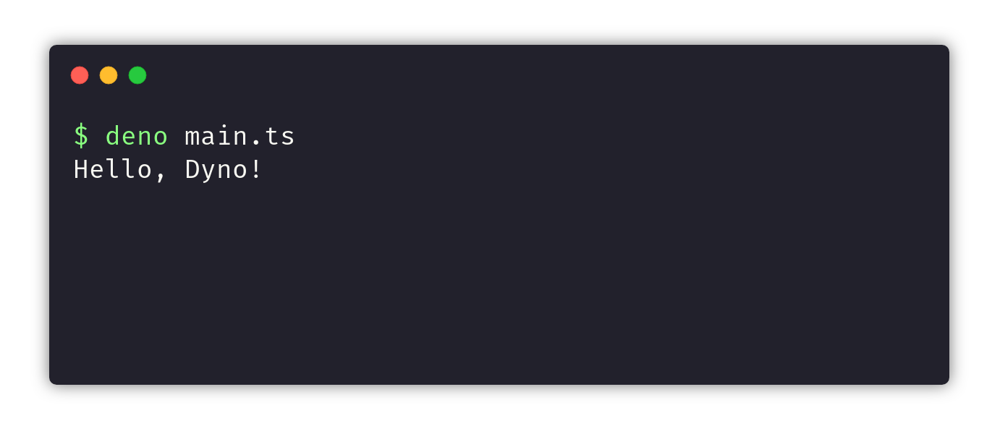

## What is Deno?

Deno is a secure Runtime for executing the JavaScript and TypeScript outside the browser environment. Which is built on top of V8 JavaScript engine and the Rust programming language. It is led by Ryan Dahl, who started the Node.js project way back in 2009.

## Installation

Deno ships as a single binary executable with no external dependencies. Installing it is quite a simple process.

There are various ways to install Deno. I am gonna install it using [Homebrew]:

```bash
brew install deno
```

Once Deno is installed, you should be able to type `deno --version` into your command line and see something like this:

```bash
$ deno --version
deno 1.0.0-rc3
v8 8.4.300
typescript 3.8.2
```

If you have trouble with installation check out the official [Deno docs].

## Hello, Deno!

Let's try a simple script creating a `main.ts` file writing a hello world, and then let’s see how to run it.

```js
console.log('Hello, Deno!');
```

Run the file with `deno main.ts` on the command line. It should print the “Hello, Deno!”:



Notice we don't need to configure the `.ts` compilation, Deno does this by default.

## Setting up an HTTP-server

Let’s do something more meaningful. Here is a basic server using the HTTP server available with the standard library.

```js
import { serve } from 'https://deno.land/std/http/server.ts';

const server = serve({
  port: 8000,
});

console.log('Listening on http://localhost:8000/');

for await (const req of server) {
  req.respond({ body: 'Hello Deno' });
}
```

In the above code, we first imported the `serve` function from the deno `http` standard module.

Inside the for loop, we are responding to the requests we got on `localhost:8000`.

Now, run the program using `deno -A main.ts`.

> `-A` flag provides all the necessary permission for your app to run on your machine

So, that was it regarding installing Deno, writing the first "hello world” program and setting up an HTTP-server.

## The Future is Bright

Deno is an interesting project, to say the least. While it may not completely replace Node.js just yet, Deno is already a fantastic programming environment for daily use.

Make sure to refer to its official [docs] for more on what you can do with Deno.


[docs]: https://deno.land/manual/
[Deno docs]: https://deno.land/
[Homebrew]: https://brew.sh/
