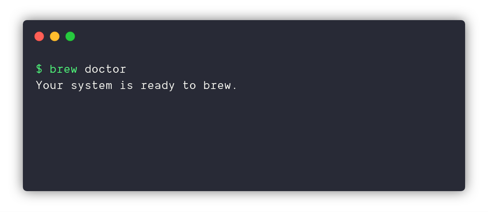

## What is Homebrew

[Homebrew][homebrew] is a popular package manager for macOS similar to `apt-get` on Debian or `pacman` on Arch. It is trivial to install and instantly provides a huge repository of software, almost all open source and free, to install on-demand. According to the creators of Homebrew, "Homebrew is the missing package manager for macOS" and that it will "install the stuff you need that Apple didn't."

With that, let’s get started.

## First things first

Install XCode command line tools if you haven’t already installed it. Open the terminal window and execute the following command.

```bash
xcode-select -install
```

## Installing Homebrew

Once command line tools installed you’re ready to install Homebrew by running the following command in the terminal window.

```bash
/usr/bin/ruby -e "$(curl -fsSL https://raw.githubusercontent.com/Homebrew/install/master/install)"
```

Wait for the download to start and for the installer to finish. That's it!

Once the installation is complete you may also run the below command to insure everything is configured correctly.

```bash
brew doctor
```



The above command will show the instructions for correcting any issues.

## Installing software packages

Once you've got Homebrew installed, you can now install your desired software packages, called [formulae][formulae]. For example, let's say I wanted to install [Git][git]. With Homebrew, installing Git is easy as this:

```bash
brew install git
```

That's it! Super fast and easy.

Since we just installed Homebrew, we could have skipped `brew update`, but it's a good habit to run it before installing anything with Homebrew because Homebrew is updated regularly.

## Next steps

Once you start hacking away on your computer, you will most likely need to install more tools with Homebrew. Before you do, remember to always run `brew update`. To upgrade your local packages, run `brew upgrade`.

Want to learn more about Brew on your own? Check out: https://brew.sh


[formulae]: https://formulae.brew.sh/formula/ "Homebrew Formulae"
[git]: https://git-scm.com/ "Git"
[homebrew]: https://brew.sh/ "The missing package manager for macOS"
